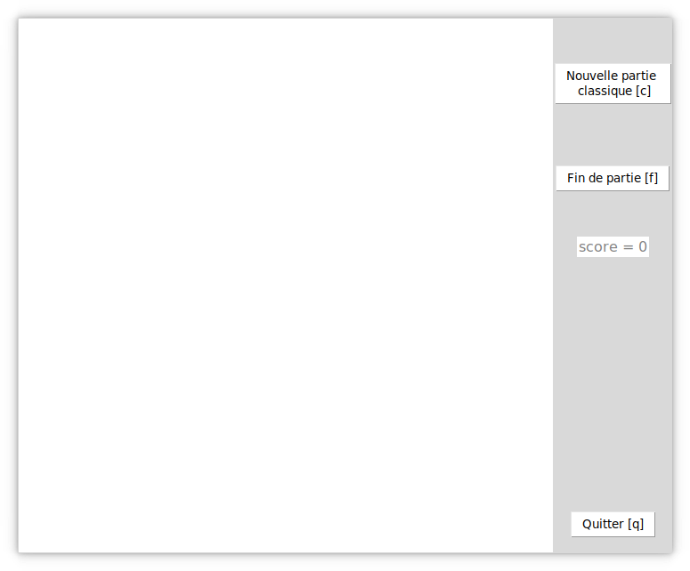
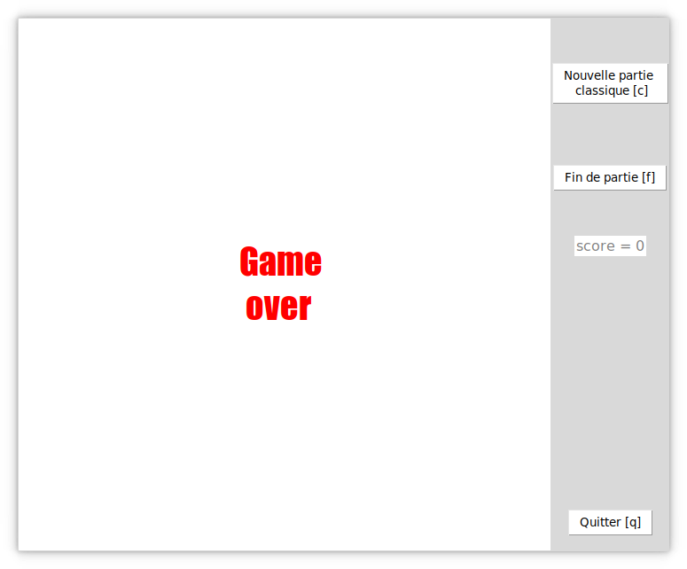
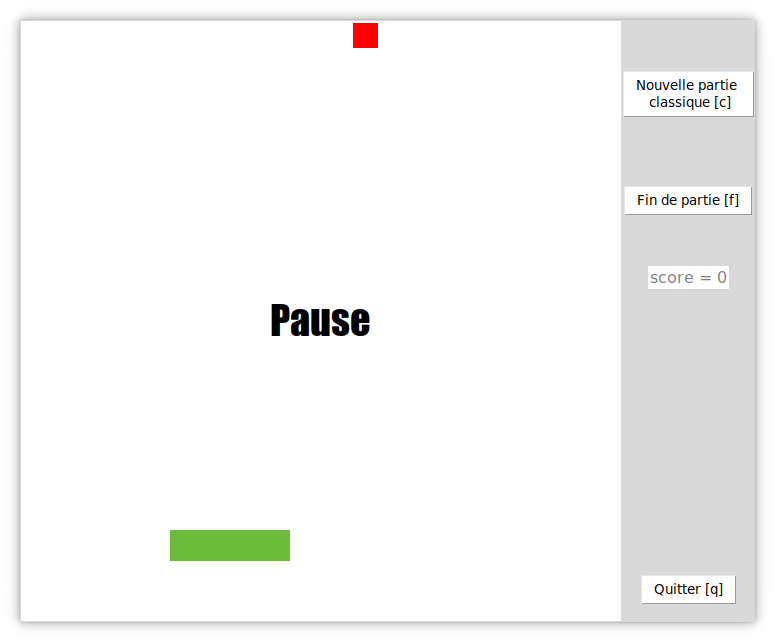

# Cahier des charges du jeu Snake

## Membres du projet

- Maxime Lefèvre  
- Pierre Fernagu--Berthier  

## But du jeu

Manger le plus de pommes possibles dans un espace restreint.  

## Règles du jeu

- La partie est finie lorsque le serpent sort de la carte ou qu'il se mord la queue.  
- Dès qu'une pomme est avalée, la queue du serpent s'agrandit.  
- Une pomme vaut un point.  
- La vitesse du serpent est constante durant toute la partie.  

## Étapes de la création du jeu

1. Faire le système du mouvement du serpent (Pierre), et du placement des pommes + système du score (Maxime).  
2. Mettre ensemble les deux parties du code. (Maxime + Pierre)  
3. Corriger le plus de bugs possible. (Maxime + Pierre) 

## Caractéristiques

### Serpent

Le serpent est divisé en bloc de forme carré. La longueur d'un côté du carré est égale à la hauteur de la carte divisée par 20. Le serpent commence avec 4 blocs puis dès qu'il mange une pomme, le serpent grandit d'un bloc.  
La couleur du serpent est un vert qui correspond au code hexadécimal suivant : #6CBB3C.  

### Pomme

Une pomme fait la taille d'un bloc dont les côtés font la même taille que les côtés composant les blocs du serpent. Les pommes sont placées de façon aléatoire sur la carte.  
Les couleurs des pommes sont aussi aléatoires, choisis dans un ensemble de couleurs prédéfinies. Les codes hexadécimaux des couleurs sont les suivants : #FF0000 pour le rouge, #8db600 pour le vert et #FFA500 pour l'orange.  

### Carte

La carte est égale à la taille du canevas sur laquelle elle est dessinée. La carte est blanche et de forme carrée.  

### Interface

Les boutons ainsi que le score sont situés à droite du canevas. En haut, se trouve les boutons pour commencer la partie et la l'arrêter. Puis en dessous, se trouve le score de la partie en cours. En bas, se trouve le bouton pour quitter le jeu. Le jeu peut être mis en pause en appuyant sur le bouton *P*.  
Le nom de la fenêtre est *Snake*.  
Nous utilisons la librairie Tkinter pour l'interface graphique ainsi que le jeu.  

## Choix du jeu

Au tout début, nous voulions faire le jeu des petits chevaux. Mais nous avons vite réalisé que cela aller être très compliqué à programmer surtout avec Tkinter. Nous avons donc changé pour faire Snake. Les différentes tâches nécessaires pour la réalisation de Snake sont aussi plus simples à répartir sur plusieurs personnes et à être développé indépendamment que pour les petits chevaux.

## Problèmes rencontrés

### Le mode infinie

Nous avons essayé de développer un mode infini dans lequel la partie dure indéfiniment. Néanmoins, ce mode contenait un grand nombre de bugs graphiques qui auraient nécessité de tout réécrire de zéro. De plus, ce mode se met à ralentir lorsque le serpent passe trop de fois d'un côté à l'autre. Nous avons donc décidé de le retirer.  

### Le choix du côté des boutons et du fonctionnement de la variable pour le sens de la direction du serpent

Il nous a fallu longtemps afin de se décider sur le choix du côté des boutons dans l'interface.Pierre voulait à gauche parce que c'est plus ergonomique, et Maxime voulait à droite mais sans véritable raison. Nous avons finalement choisi à droite.  
Idem, pour le fonctionnement de la variable pour le sens de la direction du serpent. Pierre voulait utiliser des entiers, car c'est beaucoup plus simple à programmer, et Maxime voulait utiliser des chaînes de caractères contenant le nom du sens. Nous avons finalement choisi l'option de Maxime parce que plus simple à comprendre.  

## Bugs connus

- Sur des ordinateurs peu puissants, le jeu peut commencer à ralentir et devenir injouable en fonction de la taille du serpent. Ceci est une limitation du choix de langage de programmation et de la librairie pour l'interface.  
- Le système de score ne fonctionne pas si la résolution du jeu est changé de la valeur de base, 600 pixels par 600 pixels.  
- La pomme peut très rarement venir se positionner dans le serpent, effacent la pomme et, mais ne comptabilisant pas le point. Afin de marquer le point, il faut avaler la pomme invisible. Néanmoins, ceci est très rare. Le code contient un patch afin de réduire la probabilité de cet événement.  

## Captures d'écran 

Interface principale  

Écran de fin de partie  

Écran de pause  

